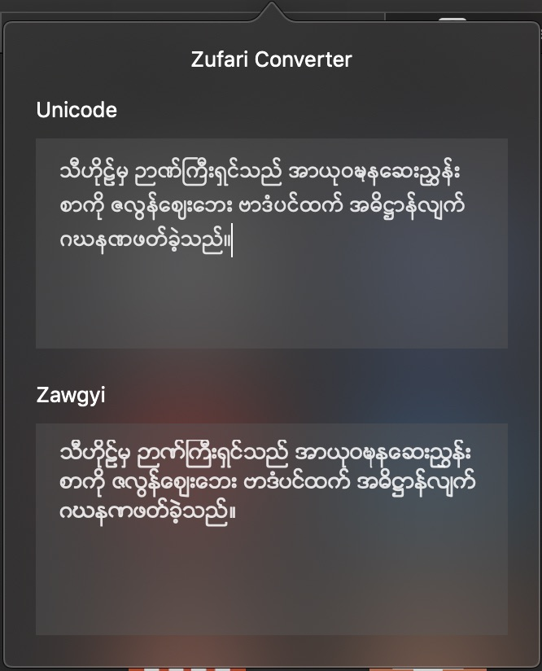
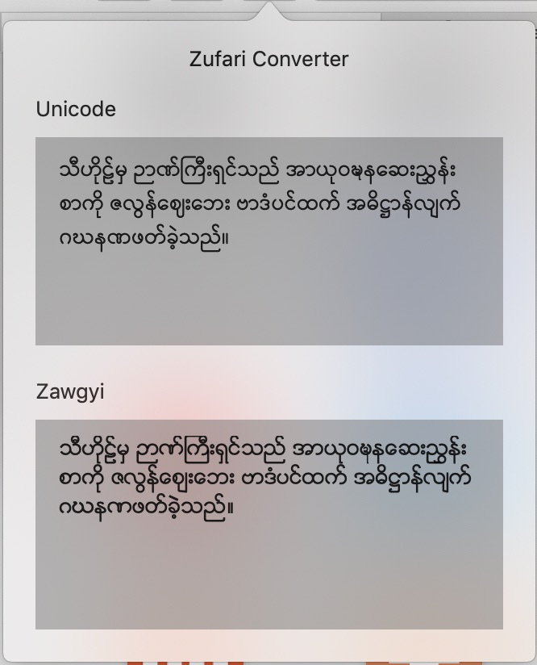

# Zufari
Zufari is a Safari Extension for a quick conversion between **Zawgyi** and **Unicode** while using **Safari**

## Features
- Text conversion between **Unicode** and **Zawgyi**
- Quick conversion within Safari on a Pop Over View
- Supports Dark Mode 🌑

## Requirement
- macOS 10.14+ (Mojave and later)

## Installation
- Download the latest version [here](https://github.com/bupstan/Zufari/releases/)
- Extract the zip file and open Zufari.app
- After the app is open, launch **Safari**
- Open preferences in Safari > Preferences - ⌘ ,
- Click on **Extensions** tab
- Among the listed extensions, tick the **Zufari Extension**
- The extension will now appear on the left side of the safari address bar

## How to use
- Click on the extension icon on the safari toolbar (**Delayed popup** is to be expected)
- Paste the text to convert in one of the text fields
		 
	**Example Case 1**: Copied text is in Unicode and wants to have Zawgyi
		 - Paste the text into Unicode Text Field
		 
	
	**Example Case 2**: Copied text is in Zawgyi and wants to have Unicode
		 - Paste the text into Zawgyi Text Field.

## Screenshots
- Dark Mode

- Light Mode

## Known Issues
- Delay when clicking on the extension button

## Why another converter?
Basically, it's a **Safari Extension** that is aimed for quick **Unicode <=> Zawgyi** conversions within **Safari** without opening a new tab or launching a separate application.

## Credits
Unicode <=> Zawgyi conversion rules are referenced from Rabbit-Converter
[Go to Rabbit-Converter](https://github.com/Rabbit-Converter/Rabbit)

## License
Zufari is licensed under "GNU GENERAL PUBLIC LICENSE". [See LICENSE](https://github.com/bupstan/Zufari/blob/master/LICENSE) for details.
